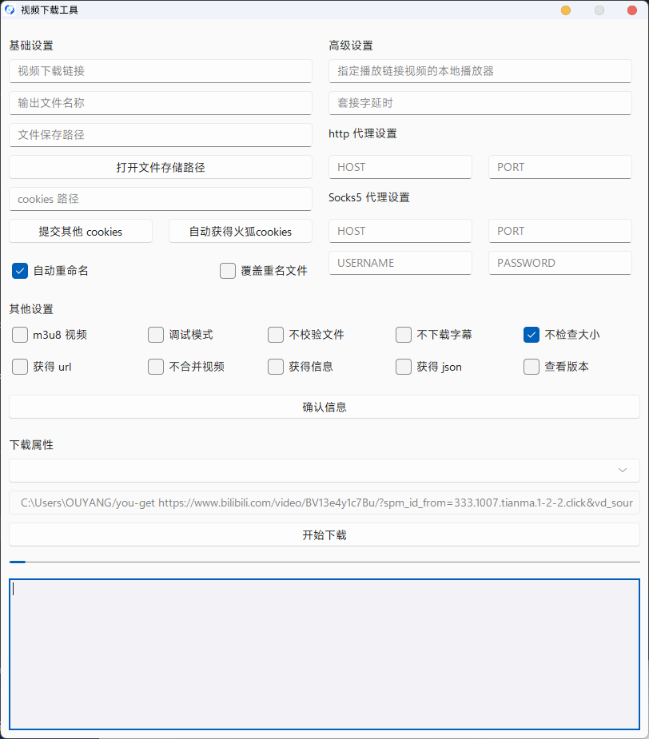
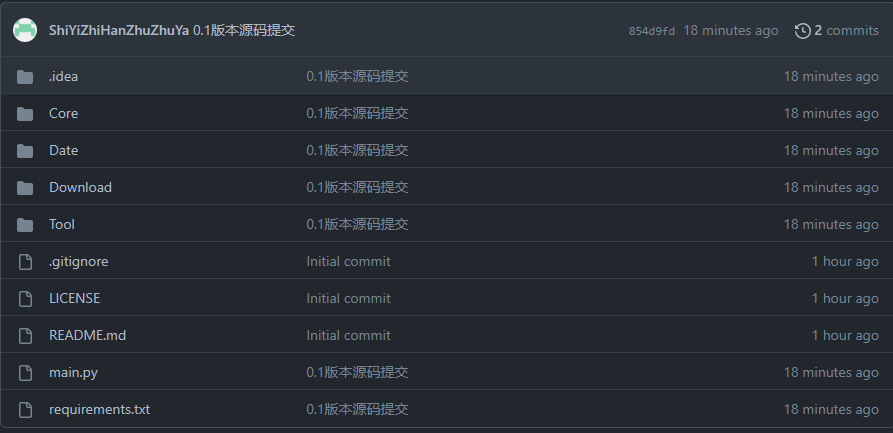

## you-get Download Tools

------

## 1 项目简介

此项目基于 you-get 开发，调用终端向 you-get 发送命令以达到下载的效果。是为了帮助不使用 python 工具的人更方便的使用 you-get 这一下载神器

## 2 项目界面

## 3 项目使用方法

#### 3.1 基础设置

------

##### 1.1 视频下载链接

视频下载链接为必填项，如果不填写该项则在确认信息时拦截

##### 1.2 输出文件名称

此项为非必填项目，若不填此项则默认为视频标题

##### 1.3 文件保存路径

此项为非必填项目，若不填此项则默认为用户主目录

##### 1.4 cookies 路径

此项为非必填项目，若不填此项则无法下载高清视频及会员视频

**提交其他 cookies：**指在非火狐浏览器保存 cookies 的位置提交 cookies，比如你的 cookies 是从网上获取的，则可以使用此项

**自动获得火狐 cookies：**此项将为安装了火狐浏览器的用户自动获得 cookies。使用时只要点一下则自动获得 cookies 存储路径

#### 3.2 确认信息

------

如果您确认您填写的信息已经填写完毕，则可以点击此按钮。程序将会对您提供的信息转换为指令并指出您填写信息的问题

#### 3.3 下载属性

------

##### 3.1 清晰度下拉框

此项暂时未完成，完成时将可以自行选择下载清晰度

##### 3.2 生成指令

此项会将生成出来的命令在这里显示

##### 3.3 开始下载

若查看生成指令后没有疑问，点击此项就会开始下载

#### 3.4 终端

------

终端是为了那些需要查看下载信息的用户提供的，在这里你可以看到操作完成后的输出（暂时未实现实时更新）

> **注意：**高级设置和其他设置不做说明，自行查阅 you-get 作者的说明

## 4 项目结构

------

正如您所见，项目总体分为5个部分，分别为：

- Core
- Date
- Download
- Tool
- 运行区（main.py)

我将会向您介绍各个分区的用处

### 4.1 Core

------

Core 是我为 you-get 写的 API，该文件夹可以复制出来单独使用

Core 文件夹涵盖了 you-get 大部分的指令，每一个指令都写了详尽的注释以便开发者使用

### 4.2 Date

------

Date 是用于存储必要的运行信息的（例如后续开发要解析的 json 文件就会暂存于该目录）

### 4.3 Download

------

Download 是为电脑小白准备的一键安装 you-get 库。

### 4.5 Tool

------

Tool 是本项目的主体

- menu.py：GUI实现文件
- tools.py ：执行函数
- constants.py：执行函数

### 4.6 运行目录

------

运行目录中有环境配置文件以及 main.py 启动文件

## 5 一些问题

------

- 本项目目前并不支持 linux 

- 本项目不支持多语言
- 本项目未解决实时显示终端信息
- 半成品状态

## 6 基于项目

------

**ttk 渲染引擎：**[rdbende/Sun-Valley-ttk-theme: A gorgeous theme for ttk, based on Microsoft's Sun Valley visual styles ✨ (github.com)](https://github.com/rdbende/Sun-Valley-ttk-theme)

**you-get：**[soimort/you-get: Dumb downloader that scrapes the web (github.com)](https://github.com/soimort/you-get)

**一键部署 you-get 支持：**[twlz0ne/you-get_install: 一键安装 you-get 到 windows (github.com)](https://github.com/twlz0ne/you-get_install)

由衷的感谢以上作者

## 7 开源许可证

------

此项目基于 MIT license 开源，我十分希望有优秀的作者能帮助我完成这个作品，此项目永不收费且永久开源

## 8 支持网站

|                Site                 | URL                                                       | Videos? | Images? | Audios? |
| :---------------------------------: | :-------------------------------------------------------- | :-----: | :-----: | :-----: |
|             **YouTube**             | <https://www.youtube.com/>                                |    ✓    |         |         |
|             **Twitter**             | <https://twitter.com/>                                    |    ✓    |    ✓    |         |
|                 VK                  | <http://vk.com/>                                          |    ✓    |    ✓    |         |
|                Vine                 | <https://vine.co/>                                        |    ✓    |         |         |
|                Vimeo                | <https://vimeo.com/>                                      |    ✓    |         |         |
|                Veoh                 | <http://www.veoh.com/>                                    |    ✓    |         |         |
|             **Tumblr**              | <https://www.tumblr.com/>                                 |    ✓    |    ✓    |    ✓    |
|                 TED                 | <http://www.ted.com/>                                     |    ✓    |         |         |
|             SoundCloud              | <https://soundcloud.com/>                                 |         |         |    ✓    |
|              SHOWROOM               | <https://www.showroom-live.com/>                          |    ✓    |         |         |
|              Pinterest              | <https://www.pinterest.com/>                              |         |    ✓    |         |
|                MTV81                | <http://www.mtv81.com/>                                   |    ✓    |         |         |
|              Mixcloud               | <https://www.mixcloud.com/>                               |         |         |    ✓    |
|              Metacafe               | <http://www.metacafe.com/>                                |    ✓    |         |         |
|               Magisto               | <http://www.magisto.com/>                                 |    ✓    |         |         |
|            Khan Academy             | <https://www.khanacademy.org/>                            |    ✓    |         |         |
|          Internet Archive           | <https://archive.org/>                                    |    ✓    |         |         |
|            **Instagram**            | <https://instagram.com/>                                  |    ✓    |    ✓    |         |
|                InfoQ                | <http://www.infoq.com/presentations/>                     |    ✓    |         |         |
|                Imgur                | <http://imgur.com/>                                       |         |    ✓    |         |
|         Heavy Music Archive         | <http://www.heavy-music.ru/>                              |         |         |    ✓    |
|              Freesound              | <http://www.freesound.org/>                               |         |         |    ✓    |
|               Flickr                | <https://www.flickr.com/>                                 |    ✓    |    ✓    |         |
|              FC2 Video              | <http://video.fc2.com/>                                   |    ✓    |         |         |
|              Facebook               | <https://www.facebook.com/>                               |    ✓    |         |         |
|                eHow                 | <http://www.ehow.com/>                                    |    ✓    |         |         |
|             Dailymotion             | <http://www.dailymotion.com/>                             |    ✓    |         |         |
|                Coub                 | <http://coub.com/>                                        |    ✓    |         |         |
|                 CBS                 | <http://www.cbs.com/>                                     |    ✓    |         |         |
|              Bandcamp               | <http://bandcamp.com/>                                    |         |         |    ✓    |
|              AliveThai              | <http://alive.in.th/>                                     |    ✓    |         |         |
|             interest.me             | <http://ch.interest.me/tvn>                               |    ✓    |         |         |
|      **755 ナナゴーゴー**       | <http://7gogo.jp/>                                        |    ✓    |    ✓    |         |
|    **niconico ニコニコ動画**    | <http://www.nicovideo.jp/>                                |    ✓    |         |         |
| **163 网易视频 网易云音乐** | <http://v.163.com/> <http://music.163.com/>           |    ✓    |         |    ✓    |
|                56网                 | <http://www.56.com/>                                      |    ✓    |         |         |
|              **AcFun**              | <http://www.acfun.cn/>                                    |    ✓    |         |         |
|       **Baidu 百度贴吧**        | <http://tieba.baidu.com/>                                 |    ✓    |    ✓    |         |
|              爆米花网               | <http://www.baomihua.com/>                                |    ✓    |         |         |
|      **bilibili 哔哩哔哩**      | <http://www.bilibili.com/>                                |    ✓    |    ✓    |    ✓    |
|                豆瓣                 | <http://www.douban.com/>                                  |    ✓    |         |    ✓    |
|                斗鱼                 | <http://www.douyutv.com/>                                 |    ✓    |         |         |
|              凤凰视频               | <http://v.ifeng.com/>                                     |    ✓    |         |         |
|               风行网                | <http://www.fun.tv/>                                      |    ✓    |         |         |
|          iQIYI 爱奇艺           | <http://www.iqiyi.com/>                                   |    ✓    |         |         |
|               激动网                | <http://www.joy.cn/>                                      |    ✓    |         |         |
|                酷6网                | <http://www.ku6.com/>                                     |    ✓    |         |         |
|              酷狗音乐               | <http://www.kugou.com/>                                   |         |         |    ✓    |
|              酷我音乐               | <http://www.kuwo.cn/>                                     |         |         |    ✓    |
|               乐视网                | <http://www.le.com/>                                      |    ✓    |         |         |
|               荔枝FM                | <http://www.lizhi.fm/>                                    |         |         |    ✓    |
|              懒人听书               | <http://www.lrts.me/>                                     |         |         |    ✓    |
|                秒拍                 | <http://www.miaopai.com/>                                 |    ✓    |         |         |
|            MioMio弹幕网             | <http://www.miomio.tv/>                                   |    ✓    |         |         |
|         MissEvan 猫耳FM         | <http://www.missevan.com/>                                |         |         |    ✓    |
|               痞客邦                | <https://www.pixnet.net/>                                 |    ✓    |         |         |
|              PPTV聚力               | <http://www.pptv.com/>                                    |    ✓    |         |         |
|               齐鲁网                | <http://v.iqilu.com/>                                     |    ✓    |         |         |
|           QQ 腾讯视频           | <http://v.qq.com/>                                        |    ✓    |         |         |
|              企鹅直播               | <http://live.qq.com/>                                     |    ✓    |         |         |
| Sina 新浪视频 微博秒拍视频  | <http://video.sina.com.cn/> <http://video.weibo.com/> |    ✓    |         |         |
|          Sohu 搜狐视频          | <http://tv.sohu.com/>                                     |    ✓    |         |         |
|         **Tudou 土豆**          | <http://www.tudou.com/>                                   |    ✓    |         |         |
|              阳光卫视               | <http://www.isuntv.com/>                                  |    ✓    |         |         |
|         **Youku 优酷**          | <http://www.youku.com/>                                   |    ✓    |         |         |
|               战旗TV                | <http://www.zhanqi.tv/lives>                              |    ✓    |         |         |
|               央视网                | <http://www.cntv.cn/>                                     |    ✓    |         |         |
|          Naver 네이버           | <http://tvcast.naver.com/>                                |    ✓    |         |         |
|               芒果TV                | <http://www.mgtv.com/>                                    |    ✓    |         |         |
|               火猫TV                | <http://www.huomao.com/>                                  |    ✓    |         |         |
|             阳光宽频网              | <http://www.365yg.com/>                                   |    ✓    |         |         |
|              西瓜视频               | <https://www.ixigua.com/>                                 |    ✓    |         |         |
|               新片场                | <https://www.xinpianchang.com/>                           |    ✓    |         |         |
|                快手                 | <https://www.kuaishou.com/>                               |    ✓    |    ✓    |         |
|                抖音                 | <https://www.douyin.com/>                                 |    ✓    |         |         |
|               TikTok                | <https://www.tiktok.com/>                                 |    ✓    |         |         |
|            中国体育(TV)             | <http://v.zhibo.tv/>  <http://video.zhibo.tv/>        |    ✓    |         |         |
|                知乎                 | <https://www.zhihu.com/>                                  |    ✓    |         |         |
